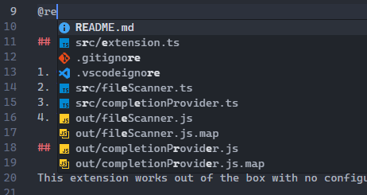

# MDSense

File mention autocomplete for Markdown files using `@`.

## Features

Type `@` followed by any character in a Markdown file to get autocomplete suggestions for files in your workspace.

## Usage

1. Open a Markdown file (`.md`)
2. Type `@` followed by a character (e.g., `@s`)
3. Select a file from the dropdown
4. The file path is inserted: `@src/index.ts`

## Settings

This extension works out of the box with no configuration needed.

## Requirements

- VS Code 1.85.0 or higher

## Release Notes

### 0.0.1

Initial release:

- File mention autocomplete with `@` trigger
- Supports all files in workspace
- Respects `.gitignore` patterns
